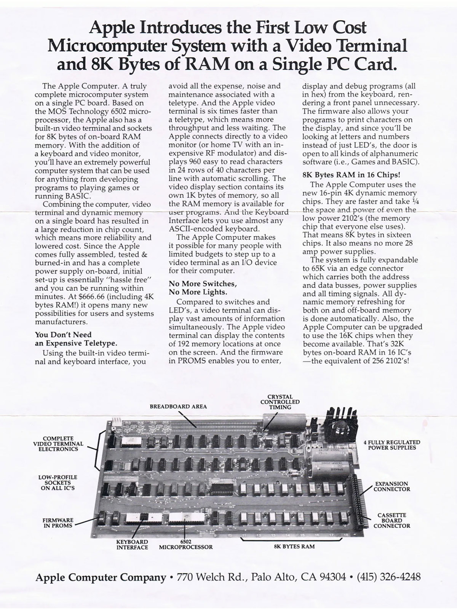

Have to dig to find gold. The benefits of speaking Parseltongue. Doing much with
little. Understand your tools intimately. Assembly? What, like it's hard?
<!--more-->
## Introduction
> Low-level programming is good for the programmer's soul.
> <br><br>
> <cite>-- John Carmack</cite>

<p></p>

> It's a long way to the ~~top~~ bottom if you wanna rock 'n' roll.
> <br><br>
> <cite>-- AC/DC</cite>

The assembly virus has infected me as a consequence of a year of web development
weakening my immune system. I have succumbed[^1].

This post is a little foray into how subroutines work in 6502 assembly. Example
of choice is a function that calculates the nth Fibonacci number. Hope you
enjoy reading it as much as I did writing it.



## What is 6502?
> The MOS Technology 6502 (typically pronounced "sixty-five-oh-two")
> is an 8-bit microprocessor. [[1]](#References)

The 6502 is cool for many reasons. It's especially attractive to those, like
myself, who want to get close to bare metal without having to deal with complex
modern architectures like x86/64 or ARM64. The other huge benefit is that
there is a large collection of wonderful resources to help you along this
journey, among them:
- [Easy 6502](https://skilldrick.github.io/easy6502/) - a tutorial webpage with a
  built-in JavaScript emulator for 6502. It's what got me started with 6502;
- Ben Eater's fantastic YouTube
  [series](https://www.youtube.com/playlist?list=PLowKtXNTBypFbtuVMUVXNR0z1mu7dp7eH)
  (particularly cool is the [WozMon
  video](https://youtu.be/HlLCtjJzHVI?feature=shared));
- [Visual 6502](http://www.visual6502.org/) - a **transistor-level** simulator of
  the 6502.

## Fibonacci

To calculate the nth Fibonacci number, I started with some high-level code.
```c
int fib(int n) {
    int fprev = 0;
    int fcurr = 1;
    for (int i = 3; i <= n; i++) {
        fcurr = fcurr + fprev;
        fprev = fcurr - fprev;
    }
    return fcurr;
}
```
Let's ignore the edge cases first (like the fact that `fib(1)` incorrectly
returns 1 instead of 0). Recall that the Fibonacci sequence is defined by the
recurrence $F_n = F_{n-1} + F_{n-2}$. This means that, at any point, all we need
to remember are two values: the previous and the current Fibonacci numbers at
the current point in the sequence. Using those, we compute the next one via the
recurrence above. Then, the next one is $F_{n+1} = F_n + F_{n-1}$. And so on.

That's exactly what the body of the for-loop does. The line
`fcurr = fcurr + fprev` is exactly the update rule as specified by the
recurrence. The new 'previous' Fibonacci number then takes on the value of the
old 'current' Fibonacci number ($\color{blue}{F_{n-1}}$ is `fprev` in $F_{n+1}
= F_n + \color{blue}{F_{n-1}}$, but `fcurr` in $F_n = \color{blue}{F_{n-1}} +
F_{n-2}$,). To achieve this, we can't just write `fprev = fcurr`, since `fcurr`
has changed its value: `fcurr` is now
`fcurr_original + fprev`. Therefore, we must set `fprev = fcurr - fprev ==
fcurr_original + fprev - fprev == fcurr_original`. (`fcurr_original` is not an
actual variable in the code, but a label to refer to the value of `fcurr` at the
start of the current loop iteration.)


## Our Setup
> The 6502 is notoriously difficult to write a compiler for because it has only
> three general-purpose registers and it doesn’t have a stack-relative
> addressing mode, meaning there’s not really an efficient way to implement
> local variables.
> <br><br><p><p>
> <cite>-- NobodyNada, Hacker News [[2]](#References):</cite>

Before we begin translating the C code to 6502 assembly, we need to get some
fundamental things in order. First, we need to determine how we're going to
supply the parameter `n` to the subroutine. In high-level programming, this is
something we take for granted (because the compiler handles it for us). As we
descend to the lower levels, in this case assembly, we need to specify this
ourselves; it is not handled automatically for us. Architectures tend to have
so-called *calling conventions*. These describe how the system should behave on
subroutine calls as it pertains to the entire flow of events: argument supply,
stack management, return addresses, etc. They help in particular compiler
writers, who need to know how the machine will handle their subroutine call so
that it does the right thing.

The cool thing about writing assembly code is that you can decide how to handle
a subroutine call whichever way you see fit. There are no restrictions beyond
the behavior of the instructions. In our case, we have a very simple function
signature: `int fib(int n)`. This lends itself to a straightforward approach:
store the argument and (later) the result in the `A` register---the accumulator.
This also matches the [calling
convention](https://llvm-mos.org/wiki/C_calling_convention) the smart folks
behind **llvm-mos** came up with.[^2]

Secondly, we need to also think about where we're going to store our local
variables. Unfortunately, there aren't enough registers in 6502 to store[^3] in
them all the variables we need. For that reason, we're going to essentially
replicate the classic idea of storing our local variables in the
stack. We have three local variables:
- `i` - the loop index
- `fprev` - the "previous" Fibonacci number, $F_{i - 2}$ at the beginning of any
  loop iteration
- `fcurr` - the "current" Fibonacci number, $F_{i - 1}$ at the beginning of any
  loop iteration

We're of course not obligated to store *all* our local variables in the stack.
In fact, the `Y` register is a so-called index register and is therefore
commonly used to store counters and offsets[^4], making it the natural habitat
for the loop index `i`. (Why `Y` instead of `X` will become clear later.) The
remaining variables `fprev` and `fcurr` will be stored in the stack, in that
order.

Lastly, there's a subtle piece we need to complete the puzzle. Recall that we
said the function parameter `n` is supplied to the subroutine in the register
`A`. However, since 6502 only offers arithmetic operations for the `A` register,
we'll need to use it for our calculations, hence we cannot store `n` in it
over the course of the execution of the subroutine. We must therefore store it
in memory, on the stack, just like the local variables `fprev` and `fcurr`.

## The 6502 Stack

There are a few important details worth knowing about the 6502 stack
[[3]](#References)[[4]](#References):
- it is 256 bytes large, with address range `$0100-$01ff`;
- there is an 8-bit stack pointer register `SP` for the lower byte of the address
  (the higher byte is always `$01`);
- there is no base pointer;
- there are only 2 read/write operations[^5]: `PHA` (push acc to stack) and
  `PLA` (pop stack to acc);
- there is no stack-relative addressing;
- there are no instructions for manipulating the stack pointer `SP` directly.

Moreover, the instructions `JSR` and `RTS` "affect the stack as the return address
is pushed onto or pulled from the stack, respectively." [[3]](#References). In fact, pushing
the return address is the first thing that is done on a subroutine call,
therefore the return address is going to be at the top of the stack frame after
the call. `RTS` then pops this address from the stack and loads it into the
`PC`. Crucially, for `RTS` to work correctly, the stack must only contain
the return address when `RTS` is called (read: the stack pointer
must point right below the location where the return address is stored). This
is necessary because, as mentioned, there is no **base** pointer. The only
information the chip has about the stack is the stack pointer.

This constraint forces us to make one last decision. Since we established the
convention that the result will be stored in the accumulator `A` on return,
and the only way to pop elements from the stack is via `PLA`, which overwrites
the accumulator, we cannot simply execute `PLA` consecutively to pop all our
variables. One option is to reserve the stack byte right below the
return address for the return *value*. Since this byte is the last to be popped
to the accumulator via `PLA`, it will load the return value correctly. Another
option is to handle the stack popping *manually*, which is the option we take.

Recall that the only piece of information the 6502 chip has about the stack
is the stack pointer. This means, the chip doesn't keep track of the number
of pushes and pops to know what is happening to the stack; it only looks
at `SP`. This means that, if we could find a way to adjust
it manually, we wouldn't have to pop things into the accumulator
at all to remove things from the stack. In fact, that's what the `PLA`
instruction does behind the scenes anyway! It loads the value at the top of the
stack into `A` and then increments `SP`. Luckily for us, there is an instruction
that allows us to modify `SP`, namely `TXS` (**T**ransfer
**`X`** to **`SP`**). (This is why we used `Y` for the loop index instead of
`X`: there is no analogous instruction `TYS`.)


We are finally ready to visualize the stack. Let's summarize the key points
before we do so:
- we store `n`, `fprev`, and `fcurr` on the stack;
- we store `i`, the loop index, in register `Y`;
- there is no base pointer register, base in the stack diagram is for our
  reference only.


Here is the stack after `fprev` and `fcurr` have been initialized.

```text
+----------------+
|     Stack      |
+----------------+
| return address | <- base      (e.g. $01FF) <- SP+5
| n              | <- base - $2 (e.g. $01FD) <- SP+3
| fprev          | <- base - $3 (e.g. $01FC) <- SP+2
| fcurr          | <- base - $4 (e.g. $01FB) <- SP+1
| -----          | <- base - $5 (e.g. $01FA) <- SP
+----------------+
```

Right away, we can define useful offsets for our stack variables. Since `SP`
always points to the address below the last element, we have an offset of:
- +1 for `fcurr`;
- +2 for `fprev`;
- +3 for `n`;
- +5 for the return address (since it's 2 bytes long).

However, since the stack pointer only stores the lower byte of the stack
address, we must store the higher byte `$01` together with the offset, such that
`SP + offset` yields the correct address. Therefore, the offsets become:
```asm
define fcurr_offset $0101
define fprev_offset $0102
define N_offset     $0103
define retaddr_offs $0105
```

## The Assembly Code

We can now begin writing the assembly program. First, let's handle the
initialization of `fprev` and `fcurr`.

```asm
fib:
  PHA             ; push n to stack

  LDA #0          ; fprev = 0
  PHA             ; push fprev to stack

  LDA #1          ; fcurr = 1
  PHA             ; push fcurr to stack

  TSX             ; store stack ptr SP in X

  LDY #2          ; load initial loop index i = 2 in Y
```

You might've noticed that we set the initial loop index to `2` instead of `3` as in
the C code. We're going to implement the equivalent for-loop `for(int i = 2; i <
n; i++)`, because it's easier to quit a loop on `i==n` in 6502 than on `i > n`.

Note that we've also stored `SP` in `X` (after setting up the stack completely).
This is needed because there is no stack-relative addressing in 6502, which
means we can't access, say, `SP + offset` with an instruction like
`LDA offset, SP`. However, there is `X`-relative addressing, so we can
write `LDA offset, X` and the value at `X + offset` will be loaded in `A`.

We can now continue with the loop body.

```asm
loop:
  ; i == n?
  TYA                     ; transfer Y to A for comparison
  CMP N_offset, X         ; if i == n?
  BEQ done                ; then done

  ; else, continue with loop

  ; fcurr = fprev + fcurr
  LDA fcurr_offset, X     ; A = fcurr
  ADC fprev_offset, X     ; A = A + fprev == fcurr + fprev
  STA fcurr_offset, X     ; fcurr = fcurr + prev

  ; fprev = fcurr - fprev
  SEC                     ; set carry for subtraction
  LDA fcurr_offset, X     ; A = fcurr
  SBC fprev_offset, X     ; A = A - fprev == fcurr - fprev
  STA fprev_offset, X     ; fprev = fcurr - fprev


  INY                     ; increment i (i++)
  JMP loop                ; go to loop start
```

Finally, we can write the last block `done` (which corresponds to `return
fcurr`). It is here we gain an appreciation for higher-level languages.
Recall that we need to modify `SP` such that it points right below the return
address, in order for `RTS` to jump to the return address. That address is
exactly the address where `n` is stored, i.e. `SP + 3`. We can't modify `SP`
directly, and we can't transfer it to any other register other than `X`. We
also can't do arithmetic with `X`, only with `A`. So, our data must flow as
follows:
```text
    TSX      TXA      ADC #3              TAX      TXS
SP -----> X -----> A --------> A = A + 3 -----> X -----> SP
```
With that taken care of, we only need to store the result in `A` before we
return. Since `X` has changed in the sequence (being now equal to `SP_old + 3`),
we can't simply write `LDA fcurr_offset, X`, since that would load the value at
`SP_old + $3 + $0101 = SP_old + $0104`, i.e. the second byte of the return
address. We need to somehow execute `LDA fcurr_offset, X - #$03`. One way to
achieve this is to simply decrease `X` by 3 again, which can be done as
follows:

```text
   SBC #3          TAX
A --------> A - 3 -----> X
```

(Technically, we must set the carry bit before the subtraction, but that is
a technical detail of the 6502 ISA that I will not go into.)

We do not need to first transfer `X` to `A` because the previous sequence
causes `A` and `X` to be equal.

Lastly, we can write `LDA fcurr_offset, X` to load the result in `A` and
`RTS` to return. All in all, the block looks like:

```asm
done:
  TXA                      ; X -> A
  CLC                      ; clear the carry bit
  ADC #03                  ; A = A + 3
  TAX                      ; A -> X
  TXS                      ; X -> SP

  SEC                      ; set the carry bit
  SBC $03                  ; A = A - 3
  TAX                      ; A -> X

  LDA fcurr_offset, X      ; A = fcurr
  RTS                      ; return
```

Piecing the different blocks together, we get:
```asm
define fcurr_offset $0101
define fprev_offset $0102
define N_offset     $0103
define retaddr_offs $0105

fib:
  PHA                      ; push n to stack

  LDA #0                   ; fprev = 0
  PHA                      ; push fprev to stack

  LDA #1                   ; fcurr = 1
  PHA                      ; push fcurr to stack

  TSX                      ; store stack ptr SP in X

  LDY #2                   ; load init loop index i = 2 in Y

loop:
  ; i == n?
  TYA                      ; transfer Y to A for comparison
  CMP N_offset, X          ; if i == n?
  BEQ done                 ; then done

  ; else, continue with loop

  ; fcurr = fprev + fcurr
  LDA fcurr_offset, X      ; A = fcurr
  ADC fprev_offset, X      ; A = A + fprev == fcurr + fprev
  STA fcurr_offset, X      ; fcurr = fcurr + prev

  ; fprev = fcurr - fprev
  SEC                      ; set carry for subtraction
  LDA fcurr_offset, X      ; A = fcurr
  SBC fprev_offset, X      ; A = A - fprev == fcurr - fprev
  STA fprev_offset, X      ; fprev = fcurr - fprev


  INY                      ; increment i (i++)
  JMP loop                 ; go to loop start

done:
  TXA                      ; X -> A
  CLC                      ; clear the carry bit
  ADC #03                  ; A = A + 3
  TAX                      ; A -> X
  TXS                      ; X -> SP

  SEC                      ; set the carry bit
  SBC $03                  ; A = A - 3
  TAX                      ; A -> X

  LDA fcurr_offset, X      ; A = fcurr
  RTS                      ; return
```

## <a name=References></a>References
[1] Wikipedia contributors. (2024, July 19). MOS Technology 6502. In Wikipedia,
The Free Encyclopedia. Retrieved 20:53, July 23, 2024, from
https://en.wikipedia.org/w/index.php?title=MOS_Technology_6502&oldid=1235478584

[2] https://news.ycombinator.com/item?id=27327636

[3] https://www.masswerk.at/6502/6502_instruction_set.html

[4] http://www.6502.org/tutorials/6502opcodes.html


[^1]: It turns out that I'd have likely been way more interested in my CompArch
    classes if they hadn't used the Orkish x86/64. Sad!
[^2]: Caveat: `llvm-mos` treats `int`s as 16-bit, whereas we set them to be 8
    bits long. This explains why the table in the `llvm-mos` wiki uses both
    the `A` and `X` registers for the function argument `int a`.
[^3]: Technically, we can *store* the three local variables in the three 6502
    registers `A`, `X` and `Y`, but we can't also operate on them at the same
    time, since 6502 only offers arithmetic operations for the `A` register.
[^4]: Having such a special-purpose register is possible because a counter is a
    universal programming concept and behaves in a uniform way. For example:
    counters are typically *incremented* or *decremented*. An ISA can then
    offer special instructions that execute those operations, like 6502 does
    with `INY` (**IN**crement **Y**) and `DEY` (**DE**crement **Y**).
[^5]: Technically, there are also read/write operations for the status register.
