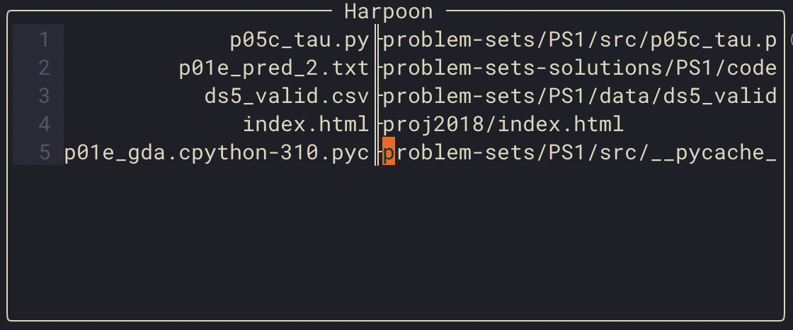

Mod, hack, fix your problems. The beauty of open-source.
<!--more-->

Due to some frustrations arising from how [harpoon](https://github.com/ThePrimeagen/harpoon)
deals with long file names, I decided to fork it and add my custom modifications. Here's what that looks like:

You can find the fork [here](https://www.github.com/ujkan/harpoon).

